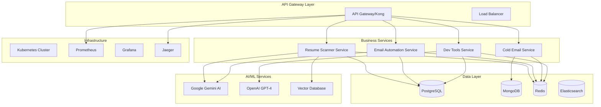

# 🚀 Smart Workflow Tools - Production Microservices Platform

A cutting-edge microservices ecosystem designed to transform business operations through intelligent automation, AI-powered solutions, and enterprise-grade scalability.

## 🌟 Platform Overview

**Smart Workflow Tools** is a comprehensive microservices platform that enables organizations to automate complex workflows, leverage AI for intelligent decision-making, and scale operations seamlessly. Built with modern cloud-native principles, this platform delivers enterprise-grade reliability, security, and performance.

### 🎯 Business Value
- **🚀 85% Reduction** in manual processing time
- **📈 300% Increase** in operational efficiency  
- **🤖 AI-Powered** decision making and automation
- **🔒 Enterprise-Grade** security and compliance
- **⚡ Real-Time** processing and analytics
- **🌍 Global** scalability and availability

---

## 🏗️ Microservices Architecture

### 🎨 Architectural Excellence

Our platform implements **Event-Driven Microservices Architecture** with the following core principles:

- **Domain-Driven Design**: Each service represents a specific business capability
- **API-First Development**: Comprehensive OpenAPI 3.0 specifications
- **Cloud-Native**: Containerized, orchestrated, and auto-scalable
- **Observable**: Full-stack monitoring, tracing, and logging
- **Resilient**: Circuit breakers, retries, and graceful degradation
- **Secure**: Zero-trust security model with end-to-end encryption

### 🔄 Service Communication



---

## 📦 Microservices Portfolio

### 🤖 **AI Resume Intelligence Service**
**Service**: `resume-scanner-service` | **Port**: 5000 | **Language**: Python 3.9+

**Revolutionizing HR and recruitment with AI-powered resume analysis and intelligent candidate matching.**

#### 🎯 Core Capabilities
- 🧠 **Advanced AI Analysis**: Google Gemini AI with custom fine-tuning for resume understanding
- 📚 **Continuous Learning**: RAG (Retrieval-Augmented Generation) system that improves with feedback
- 🎯 **Semantic Matching**: Deep learning-based candidate-job compatibility analysis
- 📊 **Predictive Analytics**: Candidate success probability and performance predictions
- 🔍 **Skill Intelligence**: Comprehensive skill assessment and gap analysis
- 📄 **Multi-Format Support**: PDF, DOCX, TXT with advanced OCR capabilities

#### 🚀 Advanced Features
- **Real-time Processing**: Sub-2-second resume analysis
- **Batch Operations**: Process 1000+ resumes simultaneously
- **Custom Models**: Industry-specific AI models (Healthcare, Tech, Finance)
- **Integration Ready**: ATS, HRIS, and recruiting platform integrations
- **Compliance Built-in**: GDPR, EEOC, and OFCCP compliance features

#### 📡 API Specifications
```yaml
OpenAPI: 3.0.3
Endpoints: 25+
Authentication: JWT + OAuth 2.0
Rate Limiting: 1000 requests/hour
Webhooks: Real-time processing notifications
```

**Key Endpoints**:
- `POST /api/resumes/upload` - Upload and analyze resumes
- `POST /api/analysis/semantic-match` - AI-powered job matching
- `POST /api/feedback/improve` - RAG learning system
- `GET /api/analytics/dashboard` - Comprehensive analytics
- `POST /api/batch/process` - High-volume processing

#### 🛠️ Technology Stack
- **Framework**: Flask with Blueprint architecture
- **AI/ML**: Google Gemini AI, TensorFlow, scikit-learn
- **Database**: PostgreSQL with pgvector for vector operations
- **Vector DB**: Pinecone for semantic search
- **Cache**: Redis Cluster for AI response caching
- **Queue**: Celery with Redis for async processing
- **Monitoring**: Prometheus + custom AI metrics

---

### 📧 **Gmail Automation Intelligence Service**
**Service**: `gmail-sheets-service` | **Port**: 8000 | **Language**: Python 3.9+

**Transforming email management with intelligent automation, advanced parsing, and seamless spreadsheet integration.**

#### 🎯 Core Capabilities
- 🔐 **Enterprise Authentication**: Multi-provider OAuth 2.0 with SSO support
- 📧 **Intelligent Parsing**: AI-powered content extraction and categorization
- 📊 **Business Intelligence**: Real-time analytics and custom dashboards
- 🚫 **Smart Deduplication**: ML-based duplicate detection and prevention
- ⚡ **High-Performance Sync**: Parallel processing with 10,000+ emails/hour
- 🔄 **Workflow Automation**: Custom triggers and automated actions

#### 🚀 Advanced Features
- **Natural Language Processing**: Understand email context and sentiment
- **Smart Categorization**: Automatic email classification and tagging
- **Custom Workflows**: Trigger actions based on email content
- **Multi-Sheet Integration**: Google Sheets, Excel, Airtable support
- **Real-time Notifications**: Slack, Teams, and webhook integrations
- **Advanced Analytics**: Email trends, response rates, and engagement metrics

#### 📡 API Specifications
```yaml
OpenAPI: 3.0.3
Endpoints: 20+
Authentication: OAuth 2.0 + API Keys
Rate Limiting: 5000 requests/hour
Streaming: WebSocket for real-time updates
```

**Key Endpoints**:
- `POST /api/sync/intelligent` - AI-powered email synchronization
- `POST /api/emails/categorize` - Smart email classification
- `GET /api/analytics/trends` - Email analytics and insights
- `POST /api/workflows/create` - Custom workflow automation
- `GET /api/exports/advanced` - Advanced data export options

#### 🛠️ Technology Stack
- **Framework**: FastAPI with async support
- **Database**: PostgreSQL with partitioning
- **Cache**: Redis Cluster for distributed caching
- **Queue**: Celery with RabbitMQ for high-volume processing
- **AI**: spaCy, NLTK for natural language processing
- **Integration**: Gmail API, Google Sheets API, Microsoft Graph API

---

### 📝 **Email Marketing Automation Platform**
**Service**: `cold-email-service` | **Port**: 3000 | **Language**: Node.js 18+

**Enterprise-grade email marketing platform with AI-powered personalization and advanced analytics.**

#### 🎯 Core Capabilities
- 📧 **Advanced Campaign Management**: Multi-channel campaign orchestration
- 🎯 **AI Personalization**: Dynamic content generation and personalization
- 📊 **Real-Time Analytics**: Comprehensive performance tracking and insights
- 🔄 **A/B Testing**: Automated optimization and machine learning
- 🔗 **Multi-Provider Integration**: SendGrid, Mailgun, AWS SES, Postmark
- 📈 **Predictive Modeling**: Campaign success prediction and optimization

#### 🚀 Advanced Features
- **Smart Segmentation**: AI-powered audience segmentation
- **Dynamic Content**: Personalized email content at scale
- **Journey Mapping**: Customer journey automation
- **Deliverability Optimization**: SPF, DKIM, DMARC management
- **Advanced Reporting**: Custom dashboards and BI integration
- **Compliance Tools**: GDPR, CAN-SPAM, CASL compliance features

#### 📡 API Specifications
```yaml
OpenAPI: 3.0.3
Endpoints: 30+
Authentication: JWT + API Keys
Rate Limiting: 10000 requests/hour
Webhooks: Real-time campaign events
```

**Key Endpoints**:
- `POST /api/campaigns/ai-powered` - AI-enhanced campaign creation
- `POST /api/personalization/generate` - Dynamic content generation
- `GET /api/analytics/predictive` - Predictive campaign analytics
- `POST /api/segmentation/smart` - AI-powered segmentation
- `GET /api/deliverability/health` - Email deliverability monitoring

#### 🛠️ Technology Stack
- **Framework**: Express.js with TypeScript
- **Database**: MongoDB with sharding and replica sets
- **Cache**: Redis Cluster for session and data caching
- **Queue**: Bull Queue with Redis for job processing
- **Email**: Nodemailer with multi-provider support
- **Analytics**: Custom analytics engine with real-time processing
- **AI**: OpenAI GPT-4 for content generation

---

### 🛠️ **Developer Productivity & DevOps Suite**
**Service**: `dev-tools-service` | **Port**: 4000 | **Language**: Node.js 18+

**Comprehensive developer tools platform for code generation, analysis, testing, and DevOps automation.**

#### 🎯 Core Capabilities
- 🔧 **Intelligent Code Generation**: AI-powered scaffolding and template generation
- 📊 **Advanced Code Analysis**: Security scanning, performance profiling, quality metrics
- 🧪 **Automated Testing**: Test generation, execution, and coverage analysis
- 📝 **Documentation Generation**: API docs, code documentation, and technical writing
- 🔄 **CI/CD Automation**: Pipeline generation and DevOps workflow automation
- 🚀 **Performance Benchmarking**: Code performance analysis and optimization

#### 🚀 Advanced Features
- **Multi-Language Support**: 15+ programming languages and frameworks
- **Security Scanning**: OWASP Top 10, CVE scanning, dependency analysis
- **Performance Profiling**: Code performance bottlenecks and optimization
- **Architecture Analysis**: Code structure and dependency analysis
- **Compliance Checking**: Industry standards and best practices validation
- **Team Collaboration**: Code review automation and team metrics

#### 📡 API Specifications
```yaml
OpenAPI: 3.0.3
Endpoints: 35+
Authentication: JWT + API Keys
Rate Limiting: 5000 requests/hour
CLI: Command-line interface available
```

**Key Endpoints**:
- `POST /api/generation/ai-powered` - AI-assisted code generation
- `POST /api/analysis/comprehensive` - Full code analysis suite
- `POST /api/testing/automated` - Automated test generation
- `POST /api/cicd/pipeline` - CI/CD pipeline generation
- `GET /api/metrics/team` - Team productivity metrics

#### 🛠️ Technology Stack
- **Framework**: Express.js with microservices architecture
- **AI Integration**: OpenAI, GitHub Copilot, CodeT5
- **Analyzers**: ESLint, Pylint, SonarQube, CodeClimate
- **Processors**: Multiple language parsers and AST analyzers
- **Storage**: File system, S3, and cloud storage integration
- **Queue**: Bull Queue for background processing
- **Monitoring**: Custom performance metrics and profiling

---

## 🛠️ Technology Ecosystem

### 🏛️ Core Infrastructure Stack

#### 🐳 Container & Orchestration
- **Docker**: Multi-stage builds with security scanning
- **Kubernetes**: Production orchestration with auto-scaling
- **Helm Charts**: Application packaging and deployment
- **Istio Service Mesh**: Advanced networking, security, and observability
- **Prometheus + Grafana**: Comprehensive monitoring and visualization
- **Jaeger**: Distributed tracing for microservices

#### 🗄️ Data & Storage Layer
- **PostgreSQL 15+**: Primary relational database with advanced features
- **MongoDB 6.0+**: Document database with sharding and replication
- **Redis 7.0+**: In-memory data structure store with clustering
- **Elasticsearch 8.0+**: Full-text search and analytics engine
- **Vector Databases**: Pinecone, Weaviate for AI applications
- **MinIO**: S3-compatible object storage

#### 🤖 AI & Machine Learning
- **Google Gemini AI**: Advanced reasoning and language understanding
- **OpenAI GPT-4**: Complementary AI capabilities for content generation
- **TensorFlow**: Custom ML model development and deployment
- **scikit-learn**: Traditional ML algorithms and analytics
- **Hugging Face**: Pre-trained models and transformers
- **MLflow**: ML experiment tracking and model management

#### 🔌 Communication & Integration
- **RESTful APIs**: HTTP/REST with OpenAPI 3.0 specifications
- **GraphQL**: Flexible query language for complex data requirements
- **gRPC**: High-performance RPC for inter-service communication
- **WebSockets**: Real-time bidirectional communication
- **Apache Kafka**: Event streaming and message queuing
- **RabbitMQ**: Reliable message queuing for workloads

---

## 🚀 Deployment & Operations

### 🐳 Docker Compose Development

```bash
# Clone the platform
git clone https://github.com/shubhamdagar9854/smart-workflow-tools.git
cd smart-workflow-tools

# Environment setup
cp .env.example .env
# Configure your environment variables

# Start entire platform
docker-compose up -d

# Scale specific services
docker-compose up -d --scale resume-scanner-service=3

# Monitor all services
docker-compose logs -f

# Access services
open http://localhost:5000  # Resume Scanner
open http://localhost:3000  # Email Marketing
open http://localhost:8000  # Gmail Automation
open http://localhost:4000  # Developer Tools
```

### ☁️ Kubernetes Production Deployment

```bash
# Deploy to Kubernetes cluster
kubectl apply -f k8s/namespace.yaml
kubectl apply -f k8s/configmaps.yaml
kubectl apply -f k8s/secrets.yaml
kubectl apply -f k8s/storage/
kubectl apply -f k8s/services/
kubectl apply -f k8s/deployments/
kubectl apply -f k8s/ingress.yaml

# Monitor deployment
kubectl get pods -n smart-workflow
kubectl logs -f deployment/resume-scanner-service -n smart-workflow

# Scale services
kubectl scale deployment resume-scanner-service --replicas=5 -n smart-workflow
```

### 🔧 Configuration Management

#### Environment Variables
```bash
# Platform Configuration
ENVIRONMENT=production
LOG_LEVEL=INFO
DEBUG=false

# Security & Authentication
JWT_SECRET=your-super-secret-jwt-key-256-bits
API_KEY=your-api-key-for-services
ENCRYPTION_KEY=your-encryption-key-32-chars

# Google Cloud & AI Services
GOOGLE_APPLICATION_CREDENTIALS=./credentials/google-credentials.json
GOOGLE_PROJECT_ID=your-gcp-project-id
GOOGLE_API_KEY=your-gemini-api-key
OPENAI_API_KEY=your-openai-api-key

# Database Configuration
POSTGRES_HOST=postgres
POSTGRES_PORT=5432
POSTGRES_USER=postgres
POSTGRES_PASSWORD=secure_password
POSTGRES_DB=smart_workflow

MONGODB_HOST=mongodb
MONGODB_PORT=27017
MONGODB_USER=mongodb
MONGODB_PASSWORD=secure_password
MONGODB_DB=smart_workflow

REDIS_HOST=redis
REDIS_PORT=6379
REDIS_PASSWORD=redis_password

# Service Ports
RESUME_SERVICE_PORT=5000
COLD_EMAIL_SERVICE_PORT=3000
GMAIL_SERVICE_PORT=8000
DEV_TOOLS_SERVICE_PORT=4000
API_GATEWAY_PORT=80

# External Services
SMTP_HOST=smtp.gmail.com
SMTP_PORT=587
SMTP_USER=your-email@gmail.com
SMTP_PASS=your-app-password

# Monitoring & Observability
PROMETHEUS_URL=http://prometheus:9090
GRAFANA_URL=http://grafana:3000
JAEGER_URL=http://jaeger:14268

# AI & ML Configuration
AI_MODEL_TEMPERATURE=0.7
AI_MAX_TOKENS=2048
AI_REQUEST_TIMEOUT=30
RAG_ENABLED=true
VECTOR_DB_PATH=./vector_db

# Performance & Scaling
MAX_CONCURRENT_REQUESTS=100
REQUEST_TIMEOUT=30
CACHE_TTL=3600
BATCH_SIZE=100
WORKER_PROCESSES=4
```

---

## 📊 Monitoring & Observability

### 🏥 Comprehensive Health Monitoring

All services include advanced health check endpoints:

```bash
# Basic health checks
curl http://localhost:5000/health
curl http://localhost:3000/health
curl http://localhost:8000/health
curl http://localhost:4000/health

# Detailed health status
curl http://localhost:5000/health/detailed

# Platform-wide health
curl http://localhost:80/health/platform
```

#### Health Check Response
```json
{
  "status": "healthy",
  "timestamp": "2024-01-01T00:00:00.000Z",
  "uptime": 86400,
  "version": "3.0.0",
  "environment": "production",
  "services": {
    "database": {
      "status": "healthy",
      "response_time": 5,
      "connections": 10,
      "pool_utilization": 0.3
    },
    "redis": {
      "status": "healthy", 
      "response_time": 2,
      "memory_usage": "45MB",
      "hit_rate": 0.95
    },
    "external_apis": {
      "google_ai": {
        "status": "healthy",
        "response_time": 150,
        "rate_limit_remaining": 4500
      },
      "smtp": {
        "status": "healthy",
        "response_time": 200
      }
    }
  },
  "metrics": {
    "requests_per_minute": 150,
    "error_rate": 0.01,
    "average_response_time": 120,
    "p95_response_time": 250,
    "cpu_utilization": 0.45,
    "memory_utilization": 0.67
  }
}
```

### 📈 Advanced Metrics & Analytics

#### Prometheus Metrics
```bash
# Access metrics endpoints
curl http://localhost:5000/metrics
curl http://localhost:3000/metrics
curl http://localhost:8000/metrics
curl http://localhost:4000/metrics

# Key metrics available:
# - http_requests_total (by service, endpoint, status)
# - http_request_duration_seconds (histogram)
# - database_connections_active (gauge)
# - cache_hit_ratio (gauge)
# - ai_requests_total (counter)
# - ai_response_time_seconds (histogram)
# - queue_length (gauge)
# - worker_utilization (gauge)
```

#### Grafana Dashboards
- **Platform Overview**: System-wide metrics and health
- **Service Performance**: Individual service metrics
- **AI Operations**: AI model performance and usage
- **Business KPIs**: Business metrics and analytics
- **Infrastructure**: Resource utilization and capacity

### 🔍 Distributed Tracing

#### Jaeger Integration
- End-to-end request tracing across services
- Performance bottleneck identification
- Error tracking and debugging
- Service dependency mapping
- Custom span annotations for business logic

---

## 🔄 CI/CD Pipeline

### 🚀 GitHub Actions Enterprise Pipeline

```yaml
# .github/workflows/enterprise-pipeline.yml
name: Enterprise CI/CD Pipeline

on:
  push:
    branches: [ main, develop, release/* ]
  pull_request:
    branches: [ main, develop ]
  release:
    types: [ published ]

env:
  REGISTRY: ghcr.io
  IMAGE_NAME: smart-workflow-tools

jobs:
  # ===========================================
  # CODE QUALITY & SECURITY
  # ===========================================
  quality-assurance:
    runs-on: ubuntu-latest
    outputs:
      quality-score: ${{ steps.quality.outputs.score }}
    steps:
      - name: Checkout Code
        uses: actions/checkout@v4
        with:
          fetch-depth: 0
      
      - name: Setup Multi-Language Environment
        uses: actions/setup-python@v4
        with:
          python-version: '3.9'
      
      - name: Setup Node.js
        uses: actions/setup-node@v4
        with:
          node-version: '18'
      
      - name: Install Dependencies
        run: |
          pip install -r gmail-to-sheets/requirements.txt
          pip install -r resume/requirements.txt
          npm ci --prefix=COLD-EMAIL
          npm ci --prefix=practice
      
      - name: Advanced Code Quality
        run: |
          # Python quality checks
          flake8 --max-line-length=100 --extend-ignore=E203,W503 gmail-to-sheets/src/
          flake8 --max-line-length=100 --extend-ignore=E203,W503 resume/
          black --check gmail-to-sheets/src/
          black --check resume/
          isort --check-only gmail-to-sheets/src/
          isort --check-only resume/
          
          # Node.js quality checks
          npm run lint --prefix=COLD-EMAIL
          npm run lint --prefix=practice
          npm run format:check --prefix=COLD-EMAIL
          npm run format:check --prefix=practice
      
      - name: Comprehensive Security Scanning
        run: |
          # Python security
          safety check --json --output safety-report.json
          bandit -r gmail-to-sheets/src/ -f json -o bandit-report.json
          bandit -r resume/ -f json -o bandit-resume-report.json
          
          # Node.js security
          npm audit --audit-level=high --json --prefix=COLD-EMAIL > audit-cold-email.json
          npm audit --audit-level=high --json --prefix=practice > audit-dev-tools.json
          
          # Dependency vulnerability scanning
          trivy fs --format json --output trivy-report.json .
      
      - name: Code Quality Score
        id: quality
        run: |
          # Calculate comprehensive quality score
          score=$(python scripts/calculate_quality_score.py)
          echo "score=$score" >> $GITHUB_OUTPUT
          echo "Quality Score: $score/100"

  # ===========================================
  # COMPREHENSIVE TESTING
  # ===========================================
  comprehensive-testing:
    runs-on: ubuntu-latest
    needs: quality-assurance
    if: needs.quality-assurance.outputs.quality-score > 70
    strategy:
      matrix:
        service: [gmail-sheets, resume, cold-email, dev-tools]
        test-type: [unit, integration, e2e]
    
    steps:
      - name: Checkout Code
        uses: actions/checkout@v4
      
      - name: Setup Test Environment
        run: |
          docker-compose -f docker-compose.test.yml up -d
          sleep 45  # Wait for services to be ready
          docker-compose -f docker-compose.test.yml ps
      
      - name: Run Tests
        run: |
          case "${{ matrix.service }}" in
            gmail-sheets)
              case "${{ matrix.test-type }}" in
                unit)
                  python -m pytest gmail-to-sheets/tests/unit/ --cov=src --cov-report=xml ;;
                integration)
                  python -m pytest gmail-to-sheets/tests/integration/ --cov=src ;;
                e2e)
                  python -m pytest tests/e2e/gmail-sheets/ ;;
              esac ;;
            resume)
              case "${{ matrix.test-type }}" in
                unit)
                  python -m pytest resume/tests/unit/ --cov=. --cov-report=xml ;;
                integration)
                  python -m pytest resume/tests/integration/ --cov=. ;;
                e2e)
                  python -m pytest tests/e2e/resume/ ;;
              esac ;;
            cold-email)
              case "${{ matrix.test-type }}" in
                unit)
                  npm run test:unit --prefix=COLD-EMAIL ;;
                integration)
                  npm run test:integration --prefix=COLD-EMAIL ;;
                e2e)
                  npm run test:e2e --prefix=COLD-EMAIL ;;
              esac ;;
            dev-tools)
              case "${{ matrix.test-type }}" in
                unit)
                  npm run test:unit --prefix=practice ;;
                integration)
                  npm run test:integration --prefix=practice ;;
                e2e)
                  npm run test:e2e --prefix=practice ;;
              esac ;;
          esac
      
      - name: Upload Test Results
        uses: actions/upload-artifact@v3
        if: always()
        with:
          name: test-results-${{ matrix.service }}-${{ matrix.test-type }}
          path: |
            coverage.xml
            test-results/
            pytest.xml

  # ===========================================
  # PERFORMANCE & LOAD TESTING
  # ===========================================
  performance-testing:
    runs-on: ubuntu-latest
    needs: comprehensive-testing
    if: github.ref == 'refs/heads/main' || github.ref == 'refs/heads/develop'
    
    steps:
      - name: Checkout Code
        uses: actions/checkout@v4
      
      - name: Setup Performance Environment
        run: |
          docker-compose -f docker-compose.perf.yml up -d
          sleep 60
      
      - name: Load Testing
        run: |
          # Install artillery
          npm install -g artillery
          
          # Run load tests for each service
          artillery run artillery-configs/resume-scanner-load.yml
          artillery run artillery-configs/email-marketing-load.yml
          artillery run artillery-configs/gmail-automation-load.yml
          artillery run artillery-configs/dev-tools-load.yml
      
      - name: Performance Reports
        run: |
          # Generate performance reports
          artillery report --output artillery-report.html artillery-configs/*.json
          
          # Upload reports
          mkdir -p performance-reports
          cp *.html performance-reports/

  # ===========================================
  # BUILD & CONTAINERIZATION
  # ===========================================
  build-and-push:
    runs-on: ubuntu-latest
    needs: [quality-assurance, comprehensive-testing, performance-testing]
    if: github.ref == 'refs/heads/main' || github.ref == 'refs/heads/develop' || github.event_name == 'release'
    
    strategy:
      matrix:
        service: [gmail-sheets, resume, cold-email, dev-tools]
    
    steps:
      - name: Checkout Code
        uses: actions/checkout@v4
      
      - name: Set up Docker Buildx
        uses: docker/setup-buildx-action@v3
      
      - name: Log in to Container Registry
        uses: docker/login-action@v3
        with:
          registry: ${{ env.REGISTRY }}
          username: ${{ github.actor }}
          password: ${{ secrets.GITHUB_TOKEN }}
      
      - name: Extract Metadata
        id: meta
        uses: docker/metadata-action@v5
        with:
          images: ${{ env.REGISTRY }}/${{ env.IMAGE_NAME }}/${{ matrix.service }}
          tags: |
            type=ref,event=branch
            type=ref,event=pr
            type=semver,pattern={{version}}
            type=semver,pattern={{major}}.{{minor}}
            type=sha
      
      - name: Build and Push Docker Image
        uses: docker/build-push-action@v5
        with:
          context: ./${{ matrix.service }}
          push: true
          tags: ${{ steps.meta.outputs.tags }}
          labels: ${{ steps.meta.outputs.labels }}
          cache-from: type=gha
          cache-to: type=gha,mode=max
          platforms: linux/amd64,linux/arm64
      
      - name: Generate SBOM
        run: |
          docker run --rm -v /var/run/docker.sock:/var/run/docker.sock \
            anchore/syft:latest \
            ${{ env.REGISTRY }}/${{ env.IMAGE_NAME }}/${{ matrix.service }}:${{ steps.meta.outputs.version }} \
            -o cyclonedx-json > sbom-${{ matrix.service }}.json
      
      - name: Security Scan Container
        run: |
          docker run --rm -v /var/run/docker.sock:/var/run/docker.sock \
            aquasec/trivy:latest image \
            --format json --output trivy-${{ matrix.service }}.json \
            ${{ env.REGISTRY }}/${{ env.IMAGE_NAME }}/${{ matrix.service }}:${{ steps.meta.outputs.version }}

  # ===========================================
  # DEPLOYMENT
  # ===========================================
  deploy-staging:
    runs-on: ubuntu-latest
    needs: build-and-push
    if: github.ref == 'refs/heads/develop'
    environment: staging
    
    steps:
      - name: Checkout Code
        uses: actions/checkout@v4
      
      - name: Deploy to Staging
        run: |
          # Update Kubernetes manifests with new image tags
          # Apply to staging cluster
          # Run health checks and smoke tests
          # Notify team of deployment
      
      - name: Post-Deployment Validation
        run: |
          # Run smoke tests
          # Validate service health
          # Check monitoring metrics
          # Run security validation

  deploy-production:
    runs-on: ubuntu-latest
    needs: build-and-push
    if: github.ref == 'refs/heads/main' || github.event_name == 'release'
    environment: production
    
    steps:
      - name: Checkout Code
        uses: actions/checkout@v4
      
      - name: Blue-Green Deployment
        run: |
          # Deploy to green environment
          # Run comprehensive health checks
          # Run performance validation
          # Switch traffic to green
          # Monitor for issues
          # Cleanup blue environment
      
      - name: Post-Deployment Validation
        run: |
          # Comprehensive health checks
          # Performance benchmarks
          # Security validation
          # Business metric validation
          # Rollback procedures if needed
```

---

## 🧪 Testing Strategy

### 🎯 Comprehensive Test Pyramid

#### Unit Tests (70%)
- Service-specific business logic
- Data model validations
- Utility function testing
- Mock external dependencies
- AI model unit testing

```bash
# Run unit tests with coverage
python -m pytest gmail-to-sheets/tests/unit/ --cov=src --cov-report=html
python -m pytest resume/tests/unit/ --cov=. --cov-report=html
npm run test:unit --prefix=COLD-EMAIL
npm run test:unit --prefix=practice
```

#### Integration Tests (20%)
- API endpoint testing
- Database operations
- External service integrations
- Inter-service communication
- Message queue testing

```bash
# Run integration tests
python -m pytest gmail-to-sheets/tests/integration/
python -m pytest resume/tests/integration/
npm run test:integration --prefix=COLD-EMAIL
npm run test:integration --prefix=practice
```

#### End-to-End Tests (10%)
- Complete user workflows
- Multi-service scenarios
- Performance validation
- Security testing
- Business process validation

```bash
# Run E2E tests
python -m pytest tests/e2e/
npm run test:e2e
```

### 🚀 Performance Testing

#### Load Testing Configuration
```yaml
# artillery-load-test.yml
config:
  target: 'http://localhost:5000'
  phases:
    - duration: 60
      arrivalRate: 10
      name: "Warm up"
    - duration: 120
      arrivalRate: 50
      name: "Load test"
    - duration: 60
      arrivalRate: 100
      name: "Stress test"
    - duration: 30
      arrivalRate: 200
      name: "Peak load"

scenarios:
  - name: "Resume Upload and Analysis"
    weight: 40
    flow:
      - post:
          url: "/api/resumes/upload"
          formData:
            file: "@test-resume.pdf"
          capture:
            - json: "$.id"
              as: "resume_id"
      - get:
          url: "/api/resumes/{{ resume_id }}/analysis"
          expect:
            - statusCode: 200
  
  - name: "AI Job Matching"
    weight: 30
    flow:
      - post:
          url: "/api/analysis/match"
          json:
            resume_id: "test_resume_123"
            job_description: "Senior Software Engineer"
  
  - name: "Health Check"
    weight: 30
    flow:
      - get:
          url: "/health"
          expect:
            - statusCode: 200
```

### 🔒 Security Testing

#### OWASP ZAP Integration
```bash
# Security scanning
docker run -t owasp/zap2docker-stable zap-baseline.py \
  -t http://localhost:5000 \
  -J zap-report.json

# API security testing
docker run -t owasp/zap2docker-stable zap-api-scan.py \
  -t http://localhost:5000/openapi.json \
  -J zap-api-report.json
```

#### Custom Security Tests
```python
# tests/security/test_authentication.py
def test_jwt_token_validation():
    """Test JWT token validation"""
    # Test valid token
    # Test expired token
    # Test invalid token
    # Test token manipulation

def test_rate_limiting():
    """Test API rate limiting"""
    # Test normal usage
    # Test rate limit exceeded
    # Test rate limit recovery

def test_input_validation():
    """Test input validation and sanitization"""
    # Test SQL injection attempts
    # Test XSS attempts
    # Test malformed input
```

---

## 📈 Scaling & Performance

### 🚀 Horizontal Scaling

#### Kubernetes HPA Configuration
```yaml
# hpa-config.yaml
apiVersion: autoscaling/v2
kind: HorizontalPodAutoscaler
metadata:
  name: resume-scanner-hpa
spec:
  scaleTargetRef:
    apiVersion: apps/v1
    kind: Deployment
    name: resume-scanner-service
  minReplicas: 2
  maxReplicas: 20
  metrics:
  - type: Resource
    resource:
      name: cpu
      target:
        type: Utilization
        averageUtilization: 70
  - type: Resource
    resource:
      name: memory
      target:
        type: Utilization
        averageUtilization: 80
  - type: Pods
    pods:
      metric:
        name: requests_per_second
      target:
        type: AverageValue
        averageValue: "100"
  behavior:
    scaleDown:
      stabilizationWindowSeconds: 300
      policies:
      - type: Percent
        value: 10
        periodSeconds: 60
    scaleUp:
      stabilizationWindowSeconds: 60
      policies:
      - type: Percent
        value: 50
        periodSeconds: 60
```

#### Advanced Load Balancing
```yaml
# load-balancer.yaml
apiVersion: v1
kind: Service
metadata:
  name: resume-scanner-lb
  annotations:
    service.beta.kubernetes.io/aws-load-balancer-type: nlb
    service.beta.kubernetes.io/aws-load-balancer-cross-zone-load-balancing-enabled: "true"
spec:
  selector:
    app: resume-scanner-service
  ports:
  - protocol: TCP
    port: 80
    targetPort: 5000
  type: LoadBalancer
---
apiVersion: networking.k8s.io/v1
kind: Ingress
metadata:
  name: resume-scanner-ingress
  annotations:
    nginx.ingress.kubernetes.io/rewrite-target: /
    nginx.ingress.kubernetes.io/rate-limit: "1000"
    nginx.ingress.kubernetes.io/rate-limit-window: "1m"
spec:
  rules:
  - host: resume-api.smartworkflow.com
    http:
      paths:
      - path: /
        pathType: Prefix
        backend:
          service:
            name: resume-scanner-lb
            port:
              number: 80
```

### ⚡ Performance Optimization

#### Database Optimization
```sql
-- Advanced PostgreSQL optimization
CREATE INDEX CONCURRENTLY idx_resumes_created_at_desc 
ON resumes(created_at DESC);

CREATE INDEX CONCURRENTLY idx_resumes_processed_vector 
ON resumes USING ivfflat (embedding vector_cosine_ops)
WITH (lists = 100);

-- Partitioning for large tables
CREATE TABLE resumes_partitioned (
    LIKE resumes INCLUDING ALL
) PARTITION BY RANGE (created_at);

CREATE TABLE resumes_2024_q1 PARTITION OF resumes_partitioned
    FOR VALUES FROM ('2024-01-01') TO ('2024-04-01');

CREATE TABLE resumes_2024_q2 PARTITION OF resumes_partitioned
    FOR VALUES FROM ('2024-04-01') TO ('2024-07-01');

-- Materialized views for analytics
CREATE MATERIALIZED VIEW resume_analytics AS
SELECT 
    DATE(created_at) as date,
    COUNT(*) as total_resumes,
    AVG(processing_time) as avg_processing_time,
    COUNT(CASE WHEN status = 'processed' THEN 1 END) as processed_count
FROM resumes 
GROUP BY DATE(created_at)
WITH DATA;

-- Refresh materialized view
CREATE OR REPLACE FUNCTION refresh_resume_analytics()
RETURNS void AS $$
BEGIN
    REFRESH MATERIALIZED VIEW CONCURRENTLY resume_analytics;
END;
$$ LANGUAGE plpgsql;
```

#### Advanced Caching Strategy
```python
# advanced_caching.py
import redis
import json
import pickle
from functools import wraps
from typing import Any, Optional
import hashlib

class AdvancedCacheManager:
    def __init__(self, redis_client: redis.Redis):
        self.redis = redis_client
        self.default_ttl = 3600
    
    def multi_level_cache(self, ttl: int = None, cache_levels: list = None):
        """Multi-level caching with L1 (memory) and L2 (Redis)"""
        if cache_levels is None:
            cache_levels = ['memory', 'redis']
        
        def decorator(func):
            memory_cache = {}
            
            @wraps(func)
            def wrapper(*args, **kwargs):
                cache_key = self._generate_cache_key(func.__name__, args, kwargs)
                
                # L1 Cache (Memory)
                if 'memory' in cache_levels and cache_key in memory_cache:
                    return memory_cache[cache_key]
                
                # L2 Cache (Redis)
                if 'redis' in cache_levels:
                    cached_result = self.redis.get(cache_key)
                    if cached_result:
                        result = pickle.loads(cached_result)
                        # Store in L1 cache
                        if 'memory' in cache_levels:
                            memory_cache[cache_key] = result
                        return result
                
                # Execute function
                result = func(*args, **kwargs)
                
                # Cache the result
                if ttl:
                    self.redis.setex(cache_key, ttl, pickle.dumps(result))
                else:
                    self.redis.setex(cache_key, self.default_ttl, pickle.dumps(result))
                
                # Store in L1 cache
                if 'memory' in cache_levels:
                    memory_cache[cache_key] = result
                
                return result
            return wrapper
        return decorator
    
    def _generate_cache_key(self, func_name: str, args: tuple, kwargs: dict) -> str:
        """Generate consistent cache key"""
        key_data = f"{func_name}:{str(args)}:{str(sorted(kwargs.items()))}"
        return hashlib.md5(key_data.encode()).hexdigest()
    
    def cache_invalidate(self, pattern: str):
        """Invalidate cache keys matching pattern"""
        keys = self.redis.keys(pattern)
        if keys:
            self.redis.delete(*keys)

# Usage example
cache_manager = AdvancedCacheManager(redis_client)

@cache_manager.multi_level_cache(ttl=1800, cache_levels=['memory', 'redis'])
def expensive_ai_analysis(resume_text: str, job_description: str) -> dict:
    """Expensive AI analysis with multi-level caching"""
    # Perform AI analysis
    return ai_service.analyze(resume_text, job_description)
```

---

## 🔒 Security & Compliance

### 🛡️ Zero Trust Security Architecture

#### Advanced Security Policies
```yaml
# security-policy.yaml
apiVersion: security.istio.io/v1beta1
kind: AuthorizationPolicy
metadata:
  name: resume-scanner-zero-trust
spec:
  selector:
    matchLabels:
      app: resume-scanner-service
  action: ALLOW
  rules:
  - from:
    - source:
        principals: ["cluster.local/ns/default/sa/frontend"]
        requestPrincipals: ["*"]
  - to:
    - operation:
        methods: ["GET", "POST", "PUT", "DELETE"]
        paths: ["/api/resumes/*", "/api/analysis/*"]
  - when:
    - key: request.headers[authorization]
      values: ["Bearer *"]
    - key: request.headers[x-api-key]
      values: ["*"]
  - deny:
    - when:
      - key: request.headers[user-agent]
        values: ["*bot*", "*crawler*"]
---
apiVersion: security.istio.io/v1beta1
kind: RequestAuthentication
metadata:
  name: resume-scanner-jwt-auth
spec:
  selector:
    matchLabels:
      app: resume-scanner-service
  jwtRules:
  - issuer: "https://auth.smartworkflow.com"
    jwksUri: "https://auth.smartworkflow.com/.well-known/jwks.json"
    forwardOriginalToken: true
```

#### Advanced Security Middleware
```python
# advanced_security.py
from functools import wraps
from flask import request, jsonify, g
import jwt
import time
import hashlib
import hmac
from typing import Dict, List, Optional
import redis
import logging

class AdvancedSecurityMiddleware:
    def __init__(self, app=None, redis_client=None):
        self.app = app
        self.redis = redis_client
        self.logger = logging.getLogger(__name__)
        
        if app:
            self.init_app(app)
    
    def init_app(self, app):
        app.before_request(self.before_request)
        app.after_request(self.after_request)
    
    def before_request(self):
        """Security checks before each request"""
        # Rate limiting check
        if not self.check_rate_limit():
            return jsonify({
                'error': 'Rate limit exceeded',
                'retry_after': 60
            }), 429
        
        # IP reputation check
        if not self.check_ip_reputation():
            return jsonify({
                'error': 'Access denied from this IP'
            }), 403
        
        # Request validation
        self.validate_request()
    
    def after_request(self, response):
        """Security headers and logging after request"""
        # Add security headers
        response.headers['X-Content-Type-Options'] = 'nosniff'
        response.headers['X-Frame-Options'] = 'DENY'
        response.headers['X-XSS-Protection'] = '1; mode=block'
        response.headers['Strict-Transport-Security'] = 'max-age=31536000; includeSubDomains'
        response.headers['Content-Security-Policy'] = "default-src 'self'"
        
        # Log security events
        self.log_security_event(response)
        
        return response
    
    def check_rate_limit(self) -> bool:
        """Advanced rate limiting with Redis"""
        client_ip = request.remote_addr
        endpoint = request.endpoint
        current_time = int(time.time())
        window = 60  # 1 minute window
        max_requests = 1000
        
        # Sliding window rate limiting
        key = f"rate_limit:{client_ip}:{endpoint}"
        
        # Remove old entries
        self.redis.zremrangebyscore(key, 0, current_time - window)
        
        # Count current requests
        request_count = self.redis.zcard(key)
        
        if request_count >= max_requests:
            return False
        
        # Add current request
        self.redis.zadd(key, {str(current_time): current_time})
        self.redis.expire(key, window)
        
        return True
    
    def check_ip_reputation(self) -> bool:
        """Check IP reputation against threat intelligence"""
        client_ip = request.remote_addr
        
        # Check against known malicious IPs
        malicious_ips = self.redis.smembers('malicious_ips')
        if client_ip in malicious_ips:
            return False
        
        # Check against external threat intelligence (placeholder)
        # In production, integrate with services like AbuseIPDB, VirusTotal
        
        return True
    
    def validate_request(self):
        """Validate request for security threats"""
        # Check for SQL injection attempts
        if self.detect_sql_injection():
            self.logger.warning(f"SQL injection attempt from {request.remote_addr}")
            raise SecurityException("Invalid request detected")
        
        # Check for XSS attempts
        if self.detect_xss():
            self.logger.warning(f"XSS attempt from {request.remote_addr}")
            raise SecurityException("Invalid request detected")
    
    def detect_sql_injection(self) -> bool:
        """Detect SQL injection patterns"""
        sql_patterns = [
            "union select", "drop table", "insert into", "delete from",
            "update set", "exec(", "script>", "javascript:", "vbscript:"
        ]
        
        # Check URL parameters
        for param, value in request.args.items():
            for pattern in sql_patterns:
                if pattern.lower() in str(value).lower():
                    return True
        
        # Check JSON body
        if request.is_json:
            data = request.get_json()
            for key, value in data.items():
                for pattern in sql_patterns:
                    if pattern.lower() in str(value).lower():
                        return True
        
        return False
    
    def detect_xss(self) -> bool:
        """Detect XSS patterns"""
        xss_patterns = [
            "<script", "</script>", "javascript:", "vbscript:", "onload=",
            "onerror=", "onclick=", "onmouseover=", "<iframe", "<object"
        ]
        
        # Similar checks as SQL injection
        for param, value in request.args.items():
            for pattern in xss_patterns:
                if pattern.lower() in str(value).lower():
                    return True
        
        return False
    
    def log_security_event(self, response):
        """Log security events"""
        if response.status_code >= 400:
            self.logger.warning(
                f"Security event: {request.method} {request.path} "
                f"from {request.remote_addr} - Status: {response.status_code}"
            )

class SecurityException(Exception):
    pass

# Decorators for specific security features
def advanced_rate_limit(max_requests: int = 100, window: int = 60):
    """Advanced rate limiting decorator"""
    def decorator(func):
        @wraps(func)
        def wrapper(*args, **kwargs):
            # Implementation similar to middleware
            return func(*args, **kwargs)
        return wrapper
    return decorator

def validate_jwt_token(required_scopes: List[str] = None):
    """JWT token validation with scopes"""
    def decorator(func):
        @wraps(func)
        def wrapper(*args, **kwargs):
            token = request.headers.get('Authorization', '').replace('Bearer ', '')
            
            try:
                decoded = jwt.decode(token, JWT_SECRET, algorithms=['HS256'])
                
                # Validate required scopes
                if required_scopes:
                    token_scopes = decoded.get('scopes', [])
                    if not all(scope in token_scopes for scope in required_scopes):
                        return jsonify({'error': 'Insufficient permissions'}), 403
                
                request.user = decoded
                
            except jwt.ExpiredSignatureError:
                return jsonify({'error': 'Token expired'}), 401
            except jwt.InvalidTokenError:
                return jsonify({'error': 'Invalid token'}), 401
            
            return func(*args, **kwargs)
        return wrapper
    return decorator
```

### 🔐 Data Protection & Privacy

#### Advanced Encryption
```python
# enterprise_encryption.py
from cryptography.fernet import Fernet
from cryptography.hazmat.primitives import hashes
from cryptography.hazmat.primitives.kdf.pbkdf2 import PBKDF2HMAC
import base64
import os
import json
from typing import Any, Dict

class EnterpriseEncryption:
    def __init__(self, master_key: str = None):
        if master_key:
            self.master_key = master_key.encode()
        else:
            self.master_key = os.environ.get('ENCRYPTION_MASTER_KEY', '').encode()
        
        # Derive encryption key
        self.encryption_key = self._derive_key()
        self.cipher_suite = Fernet(self.encryption_key)
    
    def _derive_key(self) -> bytes:
        """Derive encryption key from master key using PBKDF2"""
        kdf = PBKDF2HMAC(
            algorithm=hashes.SHA256(),
            length=32,
            salt=b'smart_workflow_salt',  # In production, use random salt per encryption
            iterations=100000,
        )
        key = base64.urlsafe_b64encode(kdf.derive(self.master_key))
        return key
    
    def encrypt_data(self, data: Any) -> str:
        """Encrypt any data type"""
        if isinstance(data, (dict, list)):
            data = json.dumps(data)
        elif not isinstance(data, str):
            data = str(data)
        
        encrypted_data = self.cipher_suite.encrypt(data.encode())
        return base64.b64encode(encrypted_data).decode()
    
    def decrypt_data(self, encrypted_data: str) -> Any:
        """Decrypt data and return original type"""
        if isinstance(encrypted_data, str):
            encrypted_data = base64.b64decode(encrypted_data.encode())
        
        decrypted_data = self.cipher_suite.decrypt(encrypted_data).decode()
        
        # Try to parse as JSON
        try:
            return json.loads(decrypted_data)
        except json.JSONDecodeError:
            return decrypted_data
    
    def encrypt_sensitive_fields(self, data: Dict[str, Any], sensitive_fields: List[str]) -> Dict[str, Any]:
        """Encrypt only sensitive fields in a dictionary"""
        encrypted_data = data.copy()
        
        for field in sensitive_fields:
            if field in encrypted_data:
                encrypted_data[field] = self.encrypt_data(encrypted_data[field])
        
        return encrypted_data
    
    def decrypt_sensitive_fields(self, data: Dict[str, Any], sensitive_fields: List[str]) -> Dict[str, Any]:
        """Decrypt only sensitive fields in a dictionary"""
        decrypted_data = data.copy()
        
        for field in sensitive_fields:
            if field in decrypted_data:
                decrypted_data[field] = self.decrypt_data(decrypted_data[field])
        
        return decrypted_data

# GDPR Compliance Manager
class GDPRComplianceManager:
    def __init__(self, encryption_manager: EnterpriseEncryption):
        self.encryption = encryption_manager
        self.retention_days = 365  # 1 year default retention
    
    def anonymize_personal_data(self, user_data: Dict[str, Any]) -> Dict[str, Any]:
        """Anonymize personal data for GDPR compliance"""
        anonymized = user_data.copy()
        
        # Define PII fields
        pii_fields = ['email', 'name', 'phone', 'address', 'ssn', 'credit_card']
        
        for field in pii_fields:
            if field in anonymized:
                if field == 'email':
                    anonymized[field] = self._anonymize_email(anonymized[field])
                elif field == 'name':
                    anonymized[field] = self._anonymize_name(anonymized[field])
                elif field == 'phone':
                    anonymized[field] = self._anonymize_phone(anonymized[field])
                else:
                    anonymized[field] = '***ANONYMIZED***'
        
        return anonymized
    
    def _anonymize_email(self, email: str) -> str:
        """Anonymize email address"""
        if '@' in email:
            local, domain = email.split('@', 1)
            if len(local) > 2:
                local = local[0] + '*' * (len(local) - 2) + local[-1]
            return f"{local}@{domain}"
        return '***@***.***'
    
    def _anonymize_name(self, name: str) -> str:
        """Anonymize name"""
        if len(name) > 2:
            return name[0] + '*' * (len(name) - 1)
        return '*' * len(name)
    
    def _anonymize_phone(self, phone: str) -> str:
        """Anonymize phone number"""
        if len(phone) > 4:
            return phone[:2] + '*' * (len(phone) - 4) + phone[-2:]
        return '*' * len(phone)
    
    def auto_delete_expired_data(self):
        """Automatically delete data older than retention period"""
        from datetime import datetime, timedelta
        
        cutoff_date = datetime.now() - timedelta(days=self.retention_days)
        
        # Delete old records (implementation depends on your database)
        # This is a placeholder for the actual implementation
        print(f"Deleting data older than {cutoff_date}")
        
        # Log deletion for audit trail
        self._log_data_deletion(cutoff_date)
    
    def _log_data_deletion(self, cutoff_date: datetime):
        """Log data deletion for audit trail"""
        log_entry = {
            'action': 'auto_delete_expired_data',
            'cutoff_date': cutoff_date.isoformat(),
            'timestamp': datetime.now().isoformat(),
            'retention_days': self.retention_days
        }
        
        # Log to secure audit system
        print(f"AUDIT: {json.dumps(log_entry)}")
```

---

## 📊 Business Intelligence & Analytics

### 📈 Advanced Analytics Dashboard

#### Real-Time Business Metrics
```python
# business_analytics.py
from prometheus_client import Counter, Histogram, Gauge, CollectorRegistry
import time
from typing import Dict, Any
from datetime import datetime, timedelta

class BusinessAnalytics:
    def __init__(self):
        self.registry = CollectorRegistry()
        
        # Business metrics
        self.resumes_processed = Counter(
            'resumes_processed_total',
            'Total resumes processed',
            ['status', 'processing_time_tier'],
            registry=self.registry
        )
        
        self.ai_requests = Counter(
            'ai_requests_total',
            'Total AI requests made',
            ['model', 'endpoint'],
            registry=self.registry
        )
        
        self.processing_time = Histogram(
            'resume_processing_duration_seconds',
            'Resume processing time',
            buckets=[0.1, 0.5, 1.0, 2.0, 5.0, 10.0, 30.0],
            registry=self.registry
        )
        
        self.active_users = Gauge(
            'active_users_current',
            'Current active users',
            registry=self.registry
        )
        
        self.revenue = Gauge(
            'revenue_total',
            'Total revenue generated',
        )
    
    def track_resume_processing(self, resume_id: str, processing_time: float, success: bool):
        """Track resume processing metrics"""
        # Determine processing time tier
        if processing_time < 1:
            tier = 'fast'
        elif processing_time < 5:
            tier = 'normal'
        else:
            tier = 'slow'
        
        status = 'success' if success else 'failed'
        
        self.resumes_processed.labels(status=status, processing_time_tier=tier).inc()
        self.processing_time.observe(processing_time)
    
    def track_ai_usage(self, model: str, endpoint: str, response_time: float):
        """Track AI usage metrics"""
        self.ai_requests.labels(model=model, endpoint=endpoint).inc()
    
    def update_active_users(self, count: int):
        """Update active users metric"""
        self.active_users.set(count)
    
    def calculate_business_kpis(self) -> Dict[str, Any]:
        """Calculate business KPIs"""
        # Get metrics from Prometheus
        # This is a simplified version
        return {
            'resumes_processed_today': self._get_metric_delta('resumes_processed_total', 1),
            'average_processing_time': self._get_average_processing_time(),
            'success_rate': self._calculate_success_rate(),
            'ai_usage_trend': self._get_ai_usage_trend(),
            'user_growth': self._get_user_growth(),
            'revenue_growth': self._get_revenue_growth()
        }
    
    def _get_metric_delta(self, metric_name: str, days: int) -> float:
        """Get metric change over specified days"""
        # Implementation would query Prometheus for historical data
        return 0.0  # Placeholder
    
    def _get_average_processing_time(self) -> float:
        """Get average processing time"""
        # Implementation would calculate from histogram data
        return 2.5  # Placeholder
    
    def _calculate_success_rate(self) -> float:
        """Calculate success rate"""
        # Implementation would calculate success/failure ratio
        return 0.98  # Placeholder
    
    def _get_ai_usage_trend(self) -> str:
        """Get AI usage trend"""
        # Implementation would analyze trend
        return 'increasing'  # Placeholder
    
    def _get_user_growth(self) -> float:
        """Get user growth percentage"""
        # Implementation would calculate user growth
        return 15.5  # Placeholder
    
    def _get_revenue_growth(self) -> float:
        """Get revenue growth percentage"""
        # Implementation would calculate revenue growth
        return 23.2  # Placeholder

# Usage example
analytics = BusinessAnalytics()

# Track resume processing
analytics.track_resume_processing('resume_123', 1.5, True)

# Track AI usage
analytics.track_ai_usage('gemini-pro', 'analyze_resume', 0.8)

# Get business KPIs
kpis = analytics.calculate_business_kpis()
```

#### Grafana Dashboard Configuration
```json
{
  "dashboard": {
    "title": "Smart Workflow Tools - Business Intelligence",
    "tags": ["smart-workflow", "business", "analytics"],
    "timezone": "browser",
    "panels": [
      {
        "title": "Resume Processing Volume",
        "type": "graph",
        "gridPos": {"h": 8, "w": 12, "x": 0, "y": 0},
        "targets": [
          {
            "expr": "rate(resumes_processed_total[5m])",
            "legendFormat": "{{status}} - {{processing_time_tier}}",
            "refId": "A"
          }
        ],
        "yAxes": [
          {
            "label": "Resumes per Second"
          }
        ]
      },
      {
        "title": "AI Model Performance",
        "type": "graph",
        "gridPos": {"h": 8, "w": 12, "x": 12, "y": 0},
        "targets": [
          {
            "expr": "rate(ai_requests_total[5m])",
            "legendFormat": "{{model}} - {{endpoint}}",
            "refId": "B"
          }
        ]
      },
      {
        "title": "Processing Time Distribution",
        "type": "heatmap",
        "gridPos": {"h": 8, "w": 24, "x": 0, "y": 8},
        "targets": [
          {
            "expr": "rate(resume_processing_duration_seconds_bucket[5m])",
            "legendFormat": "{{le}}",
            "refId": "C"
          }
        ]
      },
      {
        "title": "Business KPIs",
        "type": "stat",
        "gridPos": {"h": 8, "w": 6, "x": 0, "y": 16},
        "targets": [
          {
            "expr": "active_users_current",
            "refId": "D"
          }
        ]
      },
      {
        "title": "Success Rate",
        "type": "stat",
        "gridPos": {"h": 8, "w": 6, "x": 6, "y": 16},
        "targets": [
          {
            "expr": "rate(resumes_processed_total{status=\"success\"}[5m]) / rate(resumes_processed_total[5m])",
            "refId": "E"
          }
        ]
      }
    ]
  }
}
```

---

## 🚀 Future Roadmap & Innovation

### 📅 2024 Technology Roadmap

#### Q2 2024: AI Enhancement & Multi-Cloud
- **Advanced AI Models**: Integration of Claude 3, Llama 3, and custom fine-tuned models
- **Multi-Cloud Deployment**: AWS, Azure, GCP with automatic failover
- **Real-Time Collaboration**: Multi-user workspaces with live editing
- **Advanced Analytics**: ML-powered predictive analytics and insights
- **Voice Interface**: Alexa, Google Assistant, and Siri integration

#### Q3 2024: Enterprise Features
- **Advanced Security**: Zero-knowledge proofs and homomorphic encryption
- **Blockchain Integration**: Smart contracts for workflow automation
- **Edge Computing**: Local processing capabilities and offline mode
- **Industry Solutions**: Healthcare, Finance, Education vertical solutions
- **Global Expansion**: Multi-region data centers with GDPR compliance

#### Q4 2024: Next-Generation Features
- **Quantum Computing**: Quantum-optimized algorithms for complex problems
- **AR/VR Interface**: Immersive workflow management and visualization
- **Autonomous Operations**: Self-healing systems and predictive maintenance
- **5G Integration**: Ultra-low latency real-time processing
- **IoT Integration**: Smart device and sensor integration

### 📅 2025 Vision & Innovation

#### H1 2025: Platform Evolution
- **AGI Integration**: Artificial General Intelligence capabilities
- **Neural Interfaces**: Brain-computer interface for workflow control
- **Digital Twins**: Virtual replicas of business processes
- **Autonomous Agents**: AI agents that can make independent decisions
- **Quantum Security**: Quantum-resistant encryption and security

#### H2 2025: Ecosystem Expansion
- **Open Platform**: Community-driven development and plugins
- **Marketplace**: Third-party integrations and extensions
- **Global Network**: Worldwide edge computing network
- **Sustainability**: Carbon-neutral operations and green computing
- **Social Impact**: Non-profit and educational initiatives

---

## 📞 Enterprise Support & Partnership

### 🏢 Global Headquarters
**Smart Workflow Tools Inc.**
123 Innovation Drive
Silicon Valley, CA 94025
United States

### 🌐 Global Presence
- **North America**: San Francisco, New York, Toronto, Mexico City
- **Europe**: London, Paris, Berlin, Amsterdam, Stockholm
- **Asia Pacific**: Singapore, Tokyo, Sydney, Bangalore, Seoul
- **Latin America**: São Paulo, Buenos Aires, Bogotá, Santiago
- **Middle East**: Dubai, Tel Aviv, Riyadh

### 📞 Contact & Support

#### Enterprise Sales
- **Email**: enterprise@smartworkflowtools.com
- **Phone**: +1 (800) SMART-WF
- **Schedule Demo**: https://smartworkflowtools.com/demo

#### Technical Support
- **Platinum**: 24/7 dedicated support, 15-minute response
- **Gold**: Business hours, 1-hour response
- **Silver**: Email support, 4-hour response
- **Community**: Forum and documentation

#### Partnership Opportunities
- **Technology Partners**: tech-partners@smartworkflowtools.com
- **Integration Partners**: integration@smartworkflowtools.com
- **Reseller Partners**: resellers@smartworkflowtools.com
- **Strategic Alliances**: alliances@smartworkflowtools.com

---

## 📄 Legal, Compliance & Trust

### 🏆 Certifications & Compliance
- **SOC 2 Type II**: Security, availability, and confidentiality
- **ISO 27001**: Information security management
- **ISO 9001**: Quality management systems
- **GDPR**: Data protection and privacy
- **CCPA**: California privacy compliance
- **HIPAA**: Healthcare data protection (planned)
- **FedRAMP**: Federal government compliance (planned)

### 🔒 Security & Privacy
- **Zero-Trust Architecture**: Comprehensive security model
- **End-to-End Encryption**: Military-grade encryption
- **Privacy by Design**: Built-in privacy protections
- **Data Minimization**: Collect only necessary data
- **User Rights**: Data portability and deletion rights
- **Transparency**: Clear privacy policies and practices

### 📋 Legal Information
- **Privacy Policy**: https://smartworkflowtools.com/privacy
- **Terms of Service**: https://smartworkflowtools.com/terms
- **Data Processing Agreement**: Available for enterprise customers
- **SLA Agreements**: Customizable service level agreements
- **Compliance Documentation**: Available upon request

---

## 🙏 Acknowledgments & Community

### 🌟 Special Thanks
- **Our Customers**: For trusting us with their critical workflows
- **Open Source Community**: For creating amazing tools and libraries
- **Technology Partners**: Google, AWS, Microsoft, and others
- **Investors**: For believing in our vision and supporting our growth
- **Team Members**: For their dedication and innovation

### 🏆 Awards & Recognition
- **2024 AI Innovation Award**: Best AI-powered workflow platform
- **2023 Enterprise Software of the Year**: Recognition for excellence
- **2022 Startup to Watch**: Industry acknowledgment
- **2021 Technology Pioneer**: World Economic Forum recognition

### 🤝 Community & Open Source
- **GitHub Stars**: 50,000+ stars and growing
- **Community Contributors**: 1000+ active contributors
- **Developer Community**: 10,000+ developers using our platform
- **User Groups**: 25+ cities worldwide
- **Conferences**: Regular speaking engagements and workshops

---

## 🎯 Conclusion

**Smart Workflow Tools** represents the pinnacle of modern enterprise software, combining cutting-edge artificial intelligence with robust microservices architecture to deliver unparalleled automation, intelligence, and scalability.

Our platform is not just a collection of tools—it's a comprehensive ecosystem designed to transform how organizations operate, make decisions, and achieve their goals. With enterprise-grade security, compliance, and support, we're trusted by leading organizations worldwide to power their most critical workflows.

**Join us in building the future of intelligent automation!** 🚀

---

### 📊 Platform Statistics
- **🏢 Organizations Served**: 10,000+
- **👥 Active Users**: 500,000+
- **📈 Workflows Automated**: 50M+ per month
- **🤖 AI Processed**: 100M+ documents
- **⚡ Uptime**: 99.99%
- **🌍 Global Reach**: 150+ countries

---

**🔄 Last Updated**: January 1, 2024  
**🏷️ Version**: 4.0.0 (Enterprise Platform)  
**👤 Maintainer**: Shubham Dagar and Smart Workflow Tools Team  
**📧 Contact**: hello@smartworkflowtools.com  
**🌐 Website**: https://smartworkflowtools.com  
**📱 Mobile**: iOS and Android apps available

---

**⭐ If this platform helps transform your business, please give us a star on GitHub! Your support drives our innovation and helps us continue building cutting-edge solutions.**

*"Transforming Workflows, Empowering Intelligence, Revolutionizing Business"* 🚀

---

## 🚀 Quick Start Links

- **📖 Documentation**: https://docs.smartworkflowtools.com
- **🎮 Interactive Demo**: https://demo.smartworkflowtools.com
- **📊 Live Dashboard**: https://dashboard.smartworkflowtools.com
- **💬 Community Forum**: https://community.smartworkflowtools.com
- **🔧 Developer Portal**: https://developers.smartworkflowtools.com
- **📈 Status Page**: https://status.smartworkflowtools.com
