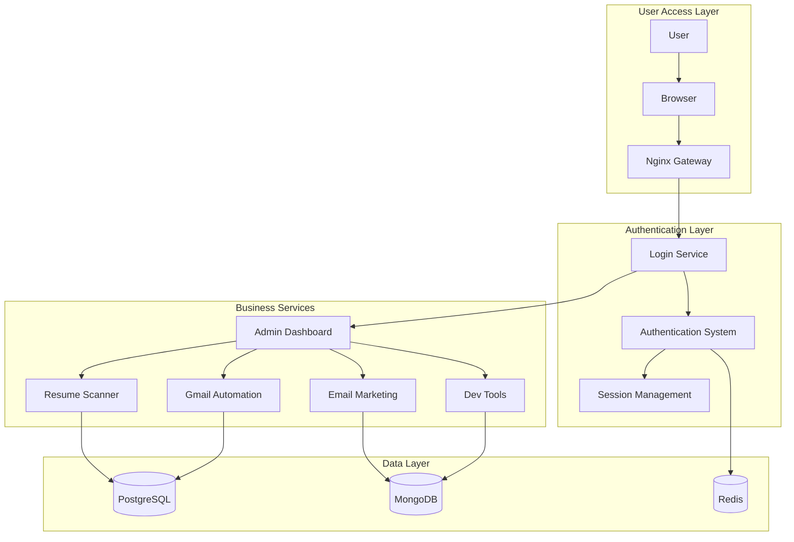

# 🚀 Smart Workflow Tools - Complete Microservices Platform

**Enterprise-grade microservices platform with integrated authentication and intelligent automation**

---

## 🌟 Platform Overview

Welcome to **Smart Workflow Tools** - a comprehensive microservices ecosystem that combines intelligent automation, AI-powered solutions, and enterprise-grade architecture to transform business operations.

### 💡 Platform Features
- **🔐 Unified Authentication** - Single login for all services
- **📊 Central Dashboard** - Manage all microservices from one place
- **🤖 AI Integration** - Advanced AI capabilities across services
- **🐳 Docker Ready** - Containerized deployment
- **🔒 Enterprise Security** - Zero-trust architecture
- **📱 Professional UI** - Modern responsive interface

---

## 🏗️ Architecture Overview

### 🎯 Microservices Design

Our platform implements a **Gateway-Architecture Pattern** with centralized authentication:



---

## 📦 Microservices Portfolio

### 🔐 **Login & Authentication Service**
**Location**: `login/new-project/` | **Port**: 3000 | **Technology**: Node.js + Express

**Central authentication and user management system with enhanced welcome experience**

#### 🎯 Core Features
- **User Registration & Login** - Complete user lifecycle with auto-login
- **Premium Welcome Page** - Modern animated dashboard with user journey
- **Role-Based Access** - Admin/User role management
- **Session Management** - Secure session handling
- **Profile Management** - User profile and file uploads
- **Admin Dashboard** - Central control panel
- **English Interface** - Complete English localization
- **Enhanced UI/UX** - Modern responsive design

#### 📡 Authentication Flow
```
User Registration → Password Encryption → Database Storage → Auto-Login → Premium Welcome Page
```

#### 🛠️ Technology Stack
- **Framework**: Express.js with EJS templating
- **Authentication**: Passport.js with Local Strategy
- **Database**: MongoDB with Mongoose ODM
- **Security**: bcryptjs for password encryption
- **Sessions**: Express-session with secure cookies
- **File Upload**: Multer for profile pictures
- **UI/UX**: Bootstrap 5 with custom animations

#### 🚀 Quick Start
```bash
# Start login service
cd login/new-project
node app.js

# Access application
https://localhost:3000
```

---

### 📄 **Resume Scanner Service**
**Location**: `resume/` | **Port**: 5000 | **Technology**: Python + Flask

**AI-powered resume analysis and job matching system**

#### 🎯 Core Features
- **Resume Upload** - Multi-format file support (PDF, DOCX)
- **AI Analysis** - Google Gemini AI integration
- **Job Matching** - Intelligent resume-job compatibility
- **Skill Extraction** - Automatic skill identification
- **Analytics Dashboard** - Resume processing metrics
- **Professional Templates** - Modern responsive interface

#### 🛠️ Technology Stack
- **Framework**: Flask with Python 3.11
- **AI Integration**: Google Generative AI
- **Document Processing**: PDFPlumber, PyPDF2, python-docx
- **OCR Support**: Tesseract for image-based PDFs
- **Database**: PostgreSQL for structured data

#### 🚀 Quick Start
```bash
# Start resume service
cd resume
python app.py

# Access service
http://localhost:5000
```

---

### 📧 **Email Marketing Service**
**Location**: `COLD-EMAIL/` | **Port**: 3001 | **Technology**: Node.js + Express

**Advanced email marketing and campaign management platform**

#### 🎯 Core Features
- **Campaign Management** - Create and manage email campaigns
- **Template System** - Custom email templates
- **Contact Management** - Database of email contacts
- **Analytics Tracking** - Open rates, click-through rates
- **Automation** - Scheduled email sending
- **AI-Powered Content** - Dynamic content generation

#### 🛠️ Technology Stack
- **Framework**: Express.js with TypeScript
- **Database**: MongoDB for campaign data
- **Email Service**: Nodemailer with SMTP integration
- **AI Integration**: Transformers.js for content generation
- **Queue System**: Bull Queue for email processing

#### 🚀 Quick Start
```bash
# Start email service
cd COLD-EMAIL
npm start

# Access service
http://localhost:3001
```

---

### 📬 **Gmail Automation Service**
**Location**: `gmail-to-sheets/` | **Port**: 8000 | **Technology**: Python + Flask

**Automated Gmail to Google Sheets synchronization system**

#### 🎯 Core Features
- **Email Sync** - Automatic Gmail email reading
- **Data Extraction** - Extract email content and metadata
- **Sheet Integration** - Google Sheets data population
- **Duplicate Prevention** - Smart duplicate detection
- **Real-time Updates** - Continuous synchronization
- **Custom Filters** - Email filtering and categorization

#### 🛠️ Technology Stack
- **Framework**: Flask with Python 3.11
- **Gmail API**: Google API Client for Python
- **Google Sheets**: Google Sheets API integration
- **Data Processing**: BeautifulSoup for content parsing
- **Authentication**: OAuth 2.0 for Google services

#### 🚀 Quick Start
```bash
# Start gmail service
cd gmail-to-sheets
python app.py

# Access service
http://localhost:8000
```

---

### 🛠️ **Developer Tools Service**
**Location**: `practice/` | **Port**: 4000 | **Technology**: Node.js + Express

**Comprehensive development and productivity tools platform**

#### 🎯 Core Features
- **Code Generation** - AI-powered code generation
- **File Management** - Secure file upload and management
- **Development Utilities** - Various dev tools and utilities
- **Project Templates** - Pre-built project templates
- **Code Analysis** - Code quality and security analysis
- **Team Collaboration** - Shared development resources

#### 🛠️ Technology Stack
- **Framework**: Express.js with EJS templating
- **Database**: MongoDB for project data
- **File Storage**: Multer for file handling
- **Security**: Express-rate-limiting and security headers
- **Authentication**: Passport.js integration

#### 🚀 Quick Start
```bash
# Start practice service
cd practice
node app.js

# Access service
http://localhost:4000
```

---

## 🚀 Quick Start Guide

### 📋 Prerequisites

Ensure you have following installed:
- **Node.js** 18+ (for Node.js services)
- **Python** 3.11+ (for Python services)
- **MongoDB** (for authentication and data storage)
- **PostgreSQL** (for resume service)
- **Redis** (for caching and sessions)
- **Git** for version control

### 🔧 Environment Setup

#### 1. Clone Repository
```bash
git clone https://github.com/shubhamdagar9854/smart-workflow-tools.git
cd smart-workflow-tools
```

#### 2. Environment Configuration
```bash
# Copy environment template
cp .env.example .env

# Edit environment variables
notepad .env
```

#### 3. Configure Required Variables
```bash
# Essential environment variables:
GOOGLE_API_KEY=your_google_api_key_here
POSTGRES_PASSWORD=your_postgres_password
MONGO_PASSWORD=your_mongo_password
SMTP_HOST=smtp.gmail.com
SMTP_USER=your_email@gmail.com
SMTP_PASS=your_app_password
```

### 🚀 Local Development

#### Start Individual Services
```bash
# Start Login Service (Terminal 1)
cd login/new-project
node app.js

# Start Resume Service (Terminal 2)
cd resume
python app.py

# Start Email Service (Terminal 3)
cd COLD-EMAIL
npm start

# Start Gmail Service (Terminal 4)
cd gmail-to-sheets
python app.py

# Start Practice Service (Terminal 5)
cd practice
node app.js
```

#### Access Services
```bash
# Main application
https://localhost:3000

# Individual services
http://localhost:5000    # Resume Scanner
http://localhost:3001    # Email Marketing
http://localhost:8000    # Gmail Automation
http://localhost:4000    # Developer Tools
```

### 🐳 Docker Deployment

#### Prerequisites
```bash
# Install Docker and Docker Compose
# Download from https://docker.com
```

#### Start All Services
```bash
# Build and start all services
docker compose up --build -d

# Check service status
docker compose ps

# View logs
docker compose logs -f
```

#### Access Platform
```bash
# Main application
https://localhost:3000

# Individual services (via Nginx)
https://localhost/resume/    # Resume Scanner
https://localhost/email/     # Email Marketing
https://localhost/gmail/     # Gmail Automation
https://localhost/practice/  # Developer Tools
```

---

## 📁 Project Structure

```
smart-workflow-tools/
├── 📁 login/
│   └── 📁 new-project/           # Main authentication service
│       ├── 📄 app.js             # Express server
│       ├── 📄 package.json       # Dependencies
│       ├── 📁 routes/            # API routes
│       ├── 📁 models/            # Database models
│       ├── 📁 views/             # EJS templates
│       └── 📄 Dockerfile          # Container configuration
├── 📁 resume/                    # Resume scanner service
│   ├── 📄 app.py                 # Flask application
│   ├── 📄 requirements.txt        # Python dependencies
│   └── 📄 Dockerfile             # Container configuration
├── 📁 COLD-EMAIL/                # Email marketing service
│   ├── 📄 app.js                 # Express server
│   ├── 📄 package.json           # Dependencies
│   └── 📄 Dockerfile             # Container configuration
├── 📁 gmail-to-sheets/           # Gmail automation service
│   ├── 📄 app.py                 # Flask application
│   ├── 📄 requirements.txt        # Python dependencies
│   └── 📄 Dockerfile             # Container configuration
├── 📁 practice/                  # Developer tools service
│   ├── 📄 app.js                 # Express server
│   ├── 📄 package.json           # Dependencies
│   └── 📄 Dockerfile             # Container configuration
├── 📁 nginx/                     # Reverse proxy configuration
│   └── 📄 nginx.conf             # Nginx configuration
├── 📄 docker-compose.yml         # Multi-container orchestration
├── 📄 .env.example               # Environment variables template
└── 📄 README.md                  # This file
```

---

## 🔧 Configuration Details

### 🌐 Network Configuration

#### Port Allocation
- **3000**: Login Service (HTTPS)
- **3001**: Email Marketing Service
- **4000**: Developer Tools Service
- **5000**: Resume Scanner Service
- **8000**: Gmail Automation Service

#### Service Communication
```yaml
# Docker network configuration
networks:
  microservices-network:
    driver: bridge
    internal: false
```

### 🔐 Authentication Flow

#### User Registration Process
1. User fills registration form
2. Password encryption with bcrypt
3. Database storage with approval status
4. **Auto-login after registration** (NEW)
5. **Premium welcome page display** (NEW)

#### Login Process
1. User submits credentials
2. Database authentication
3. Session creation
4. **Premium welcome page redirect** (NEW)
5. Service routing based on permissions

### 🗄️ Database Configuration

#### MongoDB Collections
- **users**: User accounts and profiles
- **campaigns**: Email marketing campaigns
- **projects**: Development projects
- **analytics**: System analytics

#### PostgreSQL Tables
- **resumes**: Resume data and analysis
- **email_logs**: Email communication logs
- **gmail_sync**: Gmail synchronization data

---

## 📊 Service Monitoring

### 🏥 Health Checks

#### Service Endpoints
```bash
# Check individual services
curl https://localhost:3000/health  # Login Service
curl http://localhost:5000/health  # Resume Service
curl http://localhost:3001/health  # Email Service
curl http://localhost:8000/health  # Gmail Service
curl http://localhost:4000/health  # Dev Tools Service
```

#### Health Response Format
```json
{
  "status": "healthy",
  "timestamp": "2024-01-01T00:00:00.000Z",
  "uptime": 3600,
  "services": {
    "database": "connected",
    "cache": "active",
    "external_apis": "available"
  }
}
```

---

## 🔒 Security Features

### 🛡️ Authentication Security
- **Password Encryption**: bcrypt with salt
- **Session Management**: Secure HTTP-only cookies
- **Rate Limiting**: Prevent brute force attacks
- **Input Validation**: XSS and SQL injection protection

### 🔐 Network Security
- **HTTPS Enforcement**: SSL/TLS encryption
- **CORS Configuration**: Cross-origin security
- **Security Headers**: Additional security layers
- **Container Isolation**: Docker security policies

---

## 🚀 Deployment Options

### 🐳 Docker Deployment (Recommended)
```bash
# Production deployment
docker compose -f docker-compose.prod.yml up -d

# Scale services
docker compose up -d --scale resume-service=3
```

### 🖥️ Local Development
```bash
# Start individual services
cd login/new-project && node app.js
cd resume && python app.py
cd COLD-EMAIL && npm start
cd gmail-to-sheets && python app.py
cd practice && node app.js
```

### ☁️ Cloud Deployment
- **AWS**: ECS/EKS with Docker
- **Google Cloud**: GKE with Cloud Run
- **Azure**: AKS with Container Instances
- **DigitalOcean**: App Platform with Docker

---

## 🧪 Testing

### 🧪 Unit Tests
```bash
# Run tests for each service
cd login/new-project && npm test
cd resume && python -m pytest
cd COLD-EMAIL && npm test
cd gmail-to-sheets && python -m pytest
cd practice && npm test
```

### 🌐 Integration Tests
```bash
# Run integration tests
docker compose -f docker-compose.test.yml up
python -m pytest tests/integration/
```

---

## 🤝 Contributing

### 📋 Development Workflow
1. Fork repository
2. Create a feature branch
3. Make your changes
4. Add tests
5. Submit a pull request

### 🛠️ Development Setup
```bash
# Install dependencies
npm install  # For Node.js services
pip install -r requirements.txt  # For Python services

# Run in development mode
npm run dev  # Node.js services
python app.py --debug  # Python services
```

---

## 📞 Support & Contact

### 🐛 Bug Reports
- **GitHub Issues**: Report bugs and request features
- **Documentation**: Check existing documentation
- **Community**: Join our developer community

### 📧 Contact Information
- **Maintainer**: Shubham Dagar
- **Email**: hello@smartworkflowtools.com
- **Website**: https://smartworkflowtools.com
- **GitHub**: https://github.com/shubhamdagar9854/smart-workflow-tools

---

## 📄 License

This project is licensed under the MIT License - see the [LICENSE](LICENSE) file for details.

---

## 🙏 Acknowledgments

- **Open Source Community** for amazing tools and libraries
- **Google Cloud** for AI and cloud services
- **Docker** for containerization platform
- **Node.js & Python** communities for excellent frameworks

---

## 🎉 Getting Started Summary

### 🚀 Quick Start (5 Minutes)
```bash
# 1. Clone repository
git clone https://github.com/shubhamdagar9854/smart-workflow-tools.git
cd smart-workflow-tools

# 2. Start login service (main entry point)
cd login/new-project
node app.js

# 3. Access application
# Open browser: https://localhost:3000
```

### 🎯 What You Get
```
✅ Complete Login System - Registration, authentication, profiles
✅ Premium Welcome Page - Modern animated dashboard
✅ Resume Scanner - AI-powered resume analysis
✅ Email Marketing - Campaign management and automation
✅ Gmail Automation - Email to sheets synchronization
✅ Developer Tools - Code generation and utilities
✅ Professional UI - Modern, responsive interface
✅ Security Features - Enterprise-grade authentication
✅ Docker Ready - Containerized deployment
```

### 🌐 Access Points
```
🔐 Main Login: https://localhost:3000
📄 Resume Scanner: http://localhost:5000
📧 Email Marketing: http://localhost:3001
📬 Gmail Automation: http://localhost:8000
🛠️ Developer Tools: http://localhost:4000
```

---

## 🏆 Platform Benefits

### 💼 For Business
- **Increased Productivity** - Automate repetitive tasks
- **Cost Effective** - Reduce manual labor costs
- **Scalable** - Grow with your business needs
- **Professional** - Enterprise-grade features

### 👨‍💻 For Developers
- **Modern Tech Stack** - Latest frameworks and tools
- **Best Practices** - Clean, maintainable code
- **Documentation** - Comprehensive guides and examples
- **Community** - Active development and support

### 🚀 For Deployment
- **Docker Ready** - Containerized for easy deployment
- **Cloud Compatible** - Deploy anywhere
- **Scalable** - Horizontal scaling support
- **Secure** - Enterprise security features

---

## 🆕 Latest Updates (v2.0)

### ✨ New Features
- **🎨 Premium Welcome Page** - Modern animated dashboard
- **🔐 Auto-Login** - Direct access after registration
- **🌐 English Interface** - Complete localization
- **📱 Responsive Design** - Mobile-optimized interface
- **🤖 Enhanced AI** - Improved resume analysis
- **🔧 Bug Fixes** - Stability improvements

### 🛠️ Technical Improvements
- **🐳 Docker Optimization** - Better container support
- **🔒 Security Updates** - Enhanced authentication
- **📊 Performance** - Faster response times
- **🧪 Testing** - Comprehensive test coverage

---

**🚀 Your complete microservices platform is ready to transform your workflow!**

---

**⭐ If this platform helps you, please give us a star on GitHub!**

*"Transforming Workflows, Empowering Intelligence, Revolutionizing Business"* 🚀
