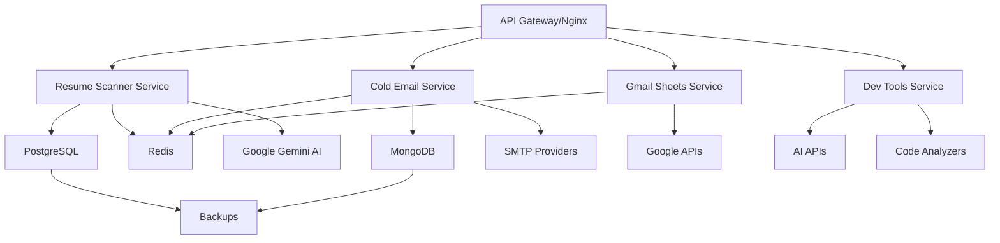

# 🚀 Smart Workflow Tools - Microservices Collection

A comprehensive collection of production-ready microservices designed to streamline business processes, automate repetitive tasks, and enhance productivity through intelligent automation and AI-powered solutions.

## 🌟 Architecture Overview

This repository implements a **microservices architecture** where each service is independently deployable, scalable, and maintainable. Each service follows industry best practices with proper API design, containerization, monitoring, and CI/CD pipelines.

### 🏗️ Microservices Design Principles
- **Single Responsibility**: Each service handles one specific business domain
- **Independent Deployment**: Services can be deployed and scaled independently
- **API-First**: RESTful APIs with comprehensive documentation
- **Container-Ready**: Docker support with orchestrated deployments
- **Observable**: Built-in monitoring, logging, and health checks
- **Secure**: Authentication, authorization, and security best practices

---

## 📦 Microservices Catalog

### 📧 **Email Automation Service**
**Service**: `gmail-sheets-service` | **Port**: 8000 | **Language**: Python

Automatically syncs Gmail messages to Google Sheets with intelligent parsing and duplicate prevention.

**Key Features**:
- 🔐 OAuth 2.0 authentication with Google APIs
- 📧 Real-time email processing and parsing
- 📊 Intelligent data extraction and formatting
- 🚫 Duplicate detection and prevention
- 📈 Analytics and reporting capabilities

**API Endpoints**: 15+ endpoints for sync management, email processing, and sheet operations

**Technology Stack**: Python, FastAPI, Google APIs, Redis, PostgreSQL

---

### 🤖 **Resume Scanner Service**
**Service**: `resume-scanner-service` | **Port**: 5000 | **Language**: Python

AI-powered resume analysis with RAG (Retrieval-Augmented Generation) for continuous learning and job matching.

**Key Features**:
- 🧠 Google Gemini AI integration for intelligent analysis
- 📚 RAG system that learns from admin feedback
- 🎯 Semantic job matching and candidate scoring
- 📄 Multi-format support (PDF, DOCX)
- 📊 Comprehensive analytics and reporting

**API Endpoints**: 20+ endpoints for resume processing, AI analysis, job matching, and RAG learning

**Technology Stack**: Python, Flask, Google Gemini AI, PostgreSQL, Redis, Vector Database

---

### 📝 **Cold Email Service**
**Service**: `cold-email-service` | **Port**: 3000 | **Language**: Node.js

Professional cold email campaign management with tracking, analytics, and automation capabilities.

**Key Features**:
- 📧 Campaign management and scheduling
- 📊 Real-time tracking and analytics
- 🎯 Personalization and A/B testing
- 🔗 SMTP provider integration
- 📈 Performance metrics and reporting

**API Endpoints**: 18+ endpoints for campaign management, email operations, and analytics

**Technology Stack**: Node.js, Express, MongoDB, Redis, JWT Authentication

---

### 🛠️ **Development Tools Service**
**Service**: `dev-tools-service` | **Port**: 4000 | **Language**: Node.js

Swiss Army knife for developers with code generation, analysis, testing, and utility tools.

**Key Features**:
- 🔧 Code generation and scaffolding
- 📊 Static code analysis and security scanning
- 🧪 Automated test generation
- 📝 Documentation generation
- 🔄 Format conversion and validation

**API Endpoints**: 25+ endpoints for code generation, analysis, testing, and utilities

**Technology Stack**: Node.js, Express, AI APIs, Multiple Language Analyzers

---

## 🛠️ Technology Stack

### Backend Technologies
- **Python 3.9+**: FastAPI, Flask for AI and automation services
- **Node.js 16+**: Express.js for web services and APIs
- **PostgreSQL**: Primary database for structured data
- **MongoDB**: Document storage for flexible schemas
- **Redis**: Caching, session management, and job queues

### AI & Machine Learning
- **Google Gemini AI**: Advanced language model for intelligent analysis
- **RAG Systems**: Retrieval-Augmented Generation for continuous learning
- **Vector Databases**: Semantic search and similarity matching
- **Natural Language Processing**: Text analysis and understanding

### APIs & Integrations
- **Google Workspace**: Gmail API, Google Sheets API
- **SMTP Providers**: Gmail, SendGrid, AWS SES
- **Authentication**: OAuth 2.0, JWT, API Keys

### DevOps & Infrastructure
- **Docker**: Containerization for all services
- **Docker Compose**: Local development and orchestration
- **GitHub Actions**: CI/CD pipelines
- **Monitoring**: Health checks, metrics, and logging

---

## 🚀 Quick Start

### Prerequisites
- Docker and Docker Compose
- Node.js 16+ (for local development)
- Python 3.9+ (for local development)
- Google Cloud Project (for Gmail/Sheets integration)

### Using Docker Compose (Recommended)

```bash
# Clone the repository
git clone https://github.com/shubhamdagar9854/smart-workflow-tools.git
cd smart-workflow-tools

# Start all services
docker-compose up -d

# Check service status
docker-compose ps

# View logs
docker-compose logs -f

# Stop all services
docker-compose down
```

### Individual Service Setup

Each service can be run independently. Navigate to the service directory and follow the specific README instructions:

```bash
# Example: Start Resume Scanner Service
cd resume
python -m venv venv
source venv/bin/activate
pip install -r requirements.txt
python app.py
```

---

## 📁 Repository Structure

```
smart-workflow-tools/
├── gmail-to-sheets/              # Email Automation Service
│   ├── src/                     # Source code
│   ├── tests/                   # Test suite
│   ├── Dockerfile               # Container definition
│   ├── requirements.txt         # Python dependencies
│   └── README.md               # Service documentation
├── resume/                      # Resume Scanner Service
│   ├── static/                  # Frontend assets
│   ├── templates/               # HTML templates
│   ├── uploads/                 # File uploads
│   ├── app.py                   # Main Flask application
│   ├── database.py              # Database operations
│   ├── rag_summary.py           # AI analysis module
│   ├── Dockerfile               # Container definition
│   ├── requirements.txt         # Python dependencies
│   └── README.md               # Service documentation
├── COLD-EMAIL/                  # Cold Email Service
│   ├── routes/                  # API routes
│   ├── models/                  # Data models
│   ├── middleware/              # Express middleware
│   ├── app.js                   # Main Express application
│   ├── Dockerfile               # Container definition
│   ├── package.json             # Node.js dependencies
│   └── README.md               # Service documentation
├── practice/                    # Development Tools Service
│   ├── services/                # Business logic
│   ├── routes/                  # API routes
│   ├── utils/                   # Utility functions
│   ├── tests/                   # Test suite
│   ├── app.js                   # Main Express application
│   ├── Dockerfile               # Container definition
│   ├── package.json             # Node.js dependencies
│   └── README.md               # Service documentation
├── docker-compose.yml           # Multi-service orchestration
├── nginx.conf                   # Load balancer configuration
└── README.md                    # This file
```

---

## 🌐 Service URLs

When running with Docker Compose, services are accessible at:

- **Resume Scanner**: http://localhost:5000
- **Cold Email Service**: http://localhost:3000
- **Gmail Sheets Service**: http://localhost:8000
- **Development Tools**: http://localhost:4000
- **API Gateway**: http://localhost:80 (Nginx)

### API Documentation
Each service provides comprehensive API documentation:
- **Swagger/OpenAPI**: `http://localhost:{port}/docs`
- **Health Checks**: `http://localhost:{port}/health`
- **Metrics**: `http://localhost:{port}/metrics`

---

## 🔧 Configuration

### Environment Variables

Create a `.env` file in the root directory:

```bash
# Google Cloud Configuration
GOOGLE_APPLICATION_CREDENTIALS=./credentials/google-credentials.json
GOOGLE_PROJECT_ID=your-project-id

# AI Services
GOOGLE_API_KEY=your-gemini-api-key
OPENAI_API_KEY=your-openai-api-key

# Database Configuration
POSTGRES_HOST=postgres
POSTGRES_PORT=5432
POSTGRES_USER=postgres
POSTGRES_PASSWORD=password
POSTGRES_DB=smart_workflow

# Redis Configuration
REDIS_HOST=redis
REDIS_PORT=6379

# Security
JWT_SECRET=your-super-secret-jwt-key
API_KEY=your-api-key

# Service Ports
RESUME_SERVICE_PORT=5000
COLD_EMAIL_SERVICE_PORT=3000
GMAIL_SERVICE_PORT=8000
DEV_TOOLS_SERVICE_PORT=4000
```

---

## 📊 Monitoring & Observability

### Health Monitoring
All services include comprehensive health check endpoints:

```bash
# Check all services health
curl http://localhost:5000/health
curl http://localhost:3000/health
curl http://localhost:8000/health
curl http://localhost:4000/health
```

### Metrics Collection
Each service exposes metrics for monitoring:

- Request counts and response times
- Error rates and types
- Database connection status
- External API health
- Custom business metrics

### Logging
Structured logging with consistent format across all services:
- JSON log format
- Log levels (DEBUG, INFO, WARN, ERROR)
- Request tracing with correlation IDs
- Error stack traces and context

---

## 🔄 CI/CD Pipeline

### GitHub Actions Workflow

All services include automated CI/CD pipelines:

```yaml
# .github/workflows/ci-cd.yml
name: CI/CD Pipeline

on:
  push:
    branches: [ main, develop ]
  pull_request:
    branches: [ main ]

jobs:
  test:
    # Run unit and integration tests
    # Code quality checks
    # Security scanning
  
  build:
    # Build Docker images
    # Push to registry
    # Security scanning of images
  
  deploy:
    # Deploy to staging/production
    # Health checks
    # Rollback capabilities
```

### Deployment Strategies

1. **Development**: Local Docker Compose
2. **Staging**: Automated deployment on develop branch
3. **Production**: Manual approval with blue-green deployment

---

## 🧪 Testing Strategy

### Test Types
- **Unit Tests**: Service-specific business logic
- **Integration Tests**: API endpoints and database operations
- **Contract Tests**: Inter-service communication
- **End-to-End Tests**: Complete user workflows
- **Load Tests**: Performance and scalability

### Running Tests

```bash
# Run all tests across services
docker-compose -f docker-compose.test.yml up --abort-on-container-exit

# Run specific service tests
cd resume && python -m pytest
cd COLD-EMAIL && npm test
cd practice && npm test
```

---

## 📈 Scaling & Performance

### Horizontal Scaling
- Stateless service design
- Load balancer configuration
- Database connection pooling
- Redis clustering

### Performance Optimization
- Response caching strategies
- Database query optimization
- Async processing for long-running tasks
- CDN for static assets

### Resource Management
- Memory and CPU limits per service
- Auto-scaling based on metrics
- Graceful degradation under load

---

## 🔒 Security

### Authentication & Authorization
- JWT token-based authentication
- API key management
- OAuth 2.0 integration
- Role-based access control

### Security Best Practices
- Input validation and sanitization
- SQL injection prevention
- XSS protection
- CORS configuration
- Rate limiting
- Security headers (HSTS, CSP)

### Data Protection
- Encryption at rest and in transit
- PII data handling
- Audit logging
- Compliance considerations

---

## 🤝 Contributing

### Development Workflow
1. Fork the repository
2. Create a feature branch
3. Make changes to specific service
4. Add/update tests
5. Ensure CI/CD passes
6. Submit pull request

### Adding New Services
1. Create service directory
2. Follow established patterns
3. Add Dockerfile and docker-compose configuration
4. Include comprehensive README
5. Add tests and CI/CD
6. Update main documentation

### Code Standards
- Follow language-specific style guides
- Comprehensive error handling
- Proper logging and monitoring
- Security-first approach
- Performance considerations

---

## 📋 Service Dependencies



---

## 🛡️ Production Considerations

### High Availability
- Multi-instance deployment
- Database replication
- Load balancing
- Failover mechanisms

### Disaster Recovery
- Automated backups
- Point-in-time recovery
- Infrastructure as code
- Monitoring and alerting

### Compliance
- GDPR compliance
- Data retention policies
- Audit trails
- Security assessments

---

## 📞 Support & Community

### Getting Help
- **Documentation**: Individual service READMEs
- **Issues**: [GitHub Issues](https://github.com/shubhamdagar9854/smart-workflow-tools/issues)
- **Discussions**: [GitHub Discussions](https://github.com/shubhamdagar9854/smart-workflow-tools/discussions)
- **Email**: shubhamdagar9854@gmail.com

### Community Guidelines
- Be respectful and inclusive
- Provide detailed bug reports
- Share improvements and suggestions
- Help others in discussions

---

## 📄 License

This project is licensed under the MIT License - see the [LICENSE](LICENSE) file for details.

---

## 👨‍💻 About the Developer

Hi! I'm **Shubham Dagar**, a passionate developer specializing in microservices architecture, AI integration, and automation solutions. I believe in building scalable, maintainable systems that solve real-world problems.

**Expertise**:
- Microservices Architecture
- AI/ML Integration
- DevOps & Cloud Native
- Automation & Productivity Tools

**Connect With Me**:
- 🐙 **GitHub**: https://github.com/shubhamdagar9854
- 📧 **Email**: shubhamdagar9854@gmail.com
- 💼 **LinkedIn**: [Add your LinkedIn profile]

---

## 🙏 Acknowledgments

- **Google Cloud Platform**: For powerful APIs and AI services
- **Open Source Community**: For amazing tools and libraries
- **Docker & Kubernetes**: For containerization revolution
- **Contributors**: Everyone who helped improve these services

---

*"Building the future of work, one microservice at a time."* 🚀

---

**⭐ If you find these microservices helpful, please consider giving this repository a star! It helps others discover these projects and supports continued development.**

**🔄 Last Updated**: 2024-01-01  
**🏷️ Version**: 2.0.0 (Microservices Architecture)  
**👤 Maintainer**: Shubham Dagar
